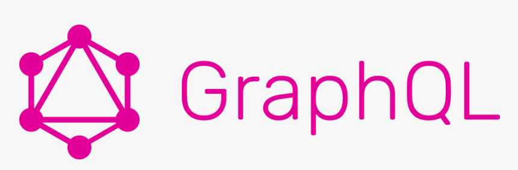

# **Introduccion a graphql desde las bases hasta crear apis**

## _**¿Que es GraphQL? 1/135**_
Es un lenguaje de consulta, que permite especificar los campos que queremos.
Desarrollado por Facebook en 2012, fue lanzado en 2015.

### _Funciones principales_
- Eficiencia.
  - Multiples consultas con solo una request.
  - Soporta para datos relacionales.
  - No se da overfetching ni underfetching.
    - overfetching: busqueda excesiva, solo los datos necesarios que se necesitan.
    - underfetching: busqueda de datos insuficientes, si queremos mas información debemos cambiar el backend.
- Sistema de tipos.
  - Describe la forma que se puede enviar o recibir los datos.
  - Contrato entre cliente / servidor.
  - Validación en el lado del servidor.
  - Seguridad adicional.
- Un único endpoint.
  - Sin problemas de endpoints
  - Desarrollo de nuevas funcionalidades sin romper compatibilidad hacia atrás.
  - Versionless API, no se versionara el api.
- Trabaja con cualquier cosa.
  - Bases de datos existentes.
  - Base de código existente.
  - Se puede construir sobre otra API.
